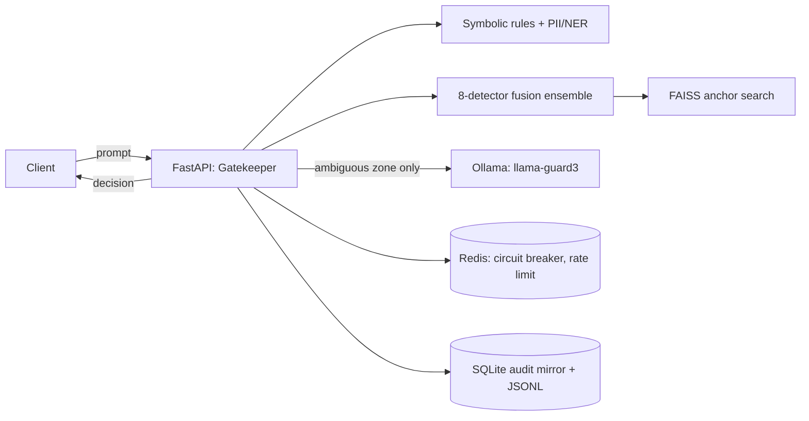

# Gatekeeper

[](https://github.com/pavann19/Gatekeeper-AI-Infrastructure-and-Governance-Gateway/actions/workflows/ci.yml)
[](https://opensource.org/licenses/MIT)

A governance gateway that sits in front of LLM calls: it screens prompts for
prompt injection and jailbreak attempts, redacts PII, enforces policy, and
fails closed when a dependency is unhealthy.

## Problem

Raw LLM prompts are non-deterministic and relying on a system prompt for
safety is a known, bypassable pattern (jailbreaks, obfuscation, injection).
Gatekeeper is backend infrastructure that intercepts a prompt before it
reaches the model, makes a policy decision (allow / restrict / block), and
writes an auditable record of that decision — for prompt-injection defense,
PII handling, and policy enforcement in front of an LLM, not as a chat UI.

## Architecture

A modular monolith: one FastAPI process plus Redis and Ollama. Everything in
the request path — symbolic rules, FAISS anchor search, the 8-detector
fusion ensemble, PII redaction, the audit writer — runs in-process; Redis
backs the circuit breaker and rate limiter, Ollama serves the optional
judge model.



## How to run

```bash
git clone https://github.com/pavann19/Gatekeeper-AI-Infrastructure-and-Governance-Gateway.git
cd Gatekeeper-AI-Infrastructure-and-Governance-Gateway && cp .env.example .env
docker compose up --build
```

Swagger docs at `http://localhost:8000/docs`, health at `/health`. `make verify`
runs unit tests, downloads the pinned detector weights, and runs a smoke
eval + short benchmark against a live instance (see [`scripts/verify.sh`](scripts/verify.sh)).

## Benchmark results

Baseline stage-level analysis (queue wait vs. detector-forward vs. embedding
time, closed-loop concurrency 1/4/16) is in
[`docs/perf/01-baseline-analysis.md`](docs/perf/01-baseline-analysis.md), raw
JSON under `_evidence/perf/`. One optimization shipped so far — pinning
torch's thread pool per worker instead of leaving it at its unpinned default
(each of 8 detectors otherwise independently claims a multi-thread pool,
oversubscribing a 12-core box under concurrent load) — tracked with what was
and wasn't re-verified in [`docs/perf/02-optimisations.md`](docs/perf/02-optimisations.md).

## Security model

Fail-closed: if a dependency required for a decision is unavailable (embedding
model, judge, cache), the request is restricted rather than silently allowed.
Trust boundary is the `/api/v1/assess` request body — everything past that
line (symbolic rules, detectors, judge) treats the prompt as untrusted input.
What's covered: prompt injection, jailbreak attempts, PII in the prompt text,
policy-scoped access via capability tokens. What isn't: output-side filtering
of the downstream LLM's own response, and multi-turn/context-carried attacks
across separate requests (each request is scored independently).

## Evaluation

Detector and fusion AUC, with 1,000-resample bootstrap confidence intervals,
on a 6,933-prompt suite from 7 sources: learned fusion reaches
**0.952 [0.945, 0.958]** AUC / 86.1% recall @ 5% FPR, against 0.949 for the
single best detector (Prompt Guard 2) — not a statistically decisive gain on
pooled AUC, but a real one on per-class coverage (the best single detector
scores 2.0% on harmful-content prompts; fusion + judge reaches 62.6%
offline). Full breakdown and the script: [`docs/ENGINEERING_ASSESSMENT.md`](docs/ENGINEERING_ASSESSMENT.md),
`benchmarks/evaluate_accuracy.py`.

## Limitations

- Concurrent-throughput numbers are from one dev machine, not a production
  host; see the baseline doc for a documented cache-warmth methodology gap
  in the first capture.
- Llama Guard (harmful-content judge) is evaluated offline only — too slow
  (17-27s/prompt on CPU) for synchronous serving today; live harmful-content
  detection sits near the anchor-only baseline until it's wired in as an
  ambiguous-zone arbiter.
- `llama_guard_3_8b` isn't hash-pinned in the model manifest (sharded
  weights don't fit the current single-file schema) and isn't in the live
  detector set.
- Secondary, present but not the resume story: MCP servers, the review
  queue UI, the policy editor, tenancy, and token quotas. The core is the
  detection pipeline plus the fail-closed gateway plus measured performance
  — see [`docs/DECISIONS.md`](docs/DECISIONS.md) for why.

Full prior README (architecture deep-dive, full API reference, project
history) is preserved at [`docs/archive/README_v1_full.md`](docs/archive/README_v1_full.md).
